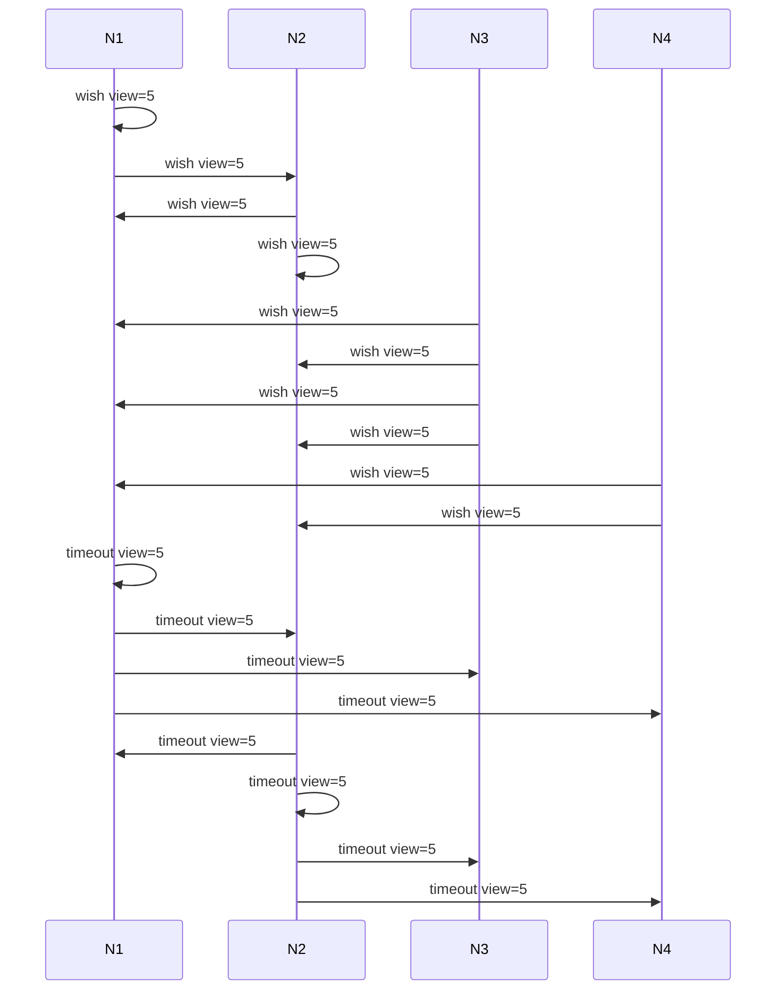
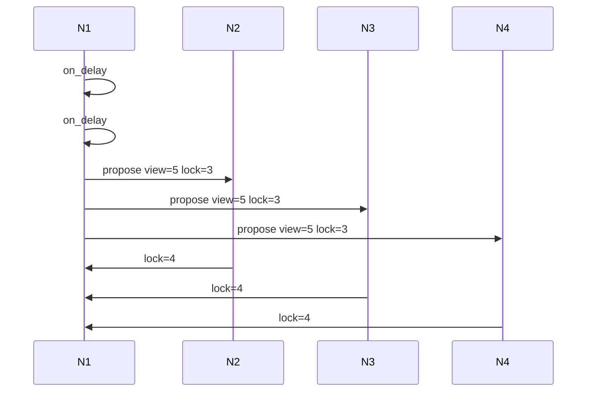
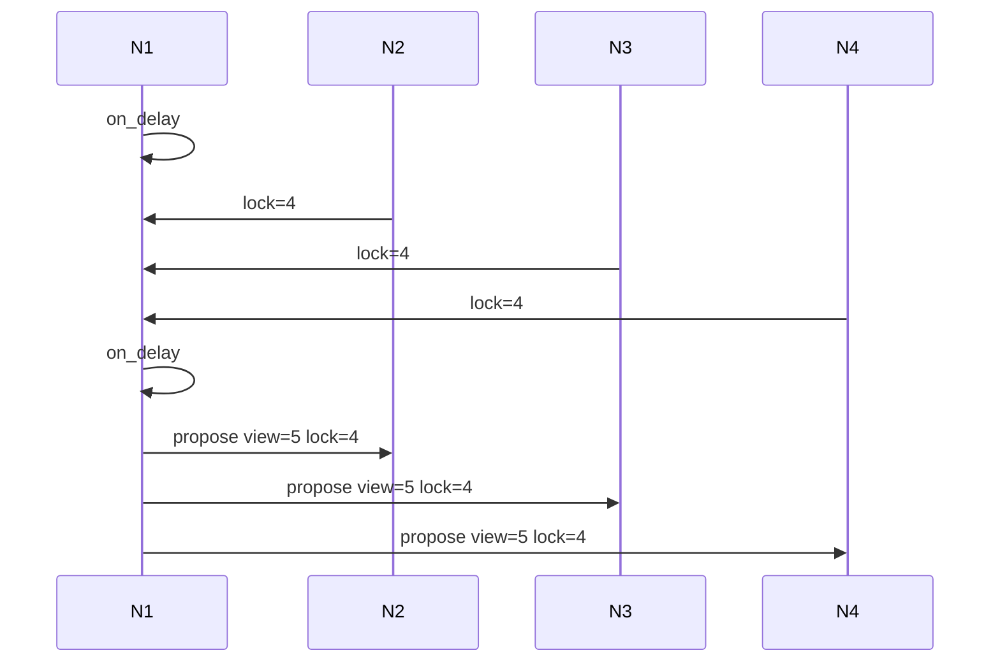
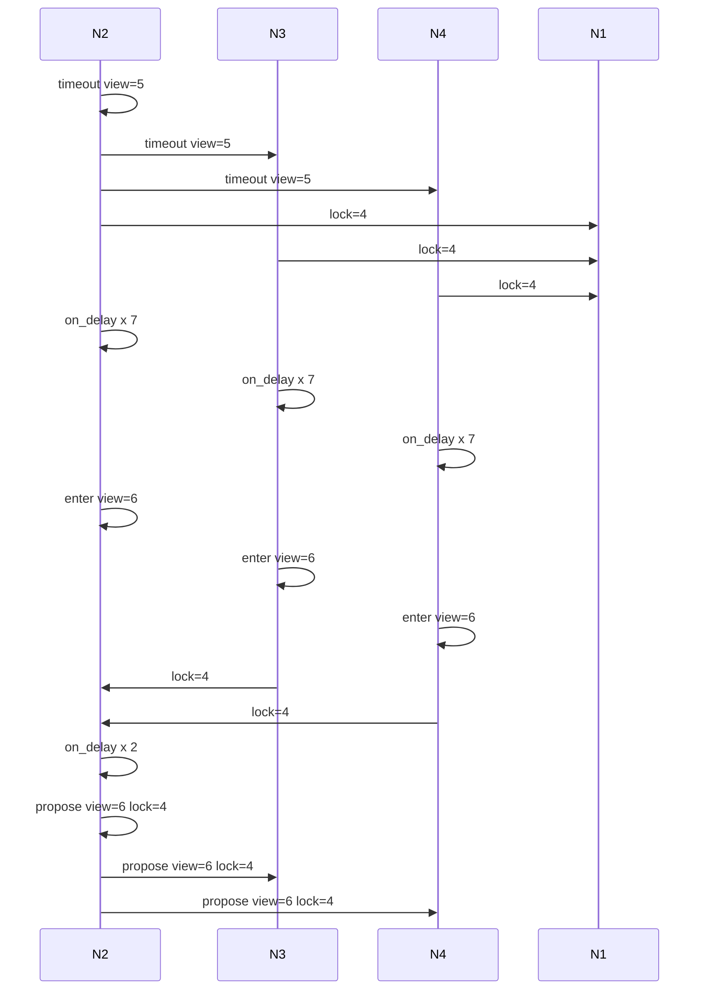
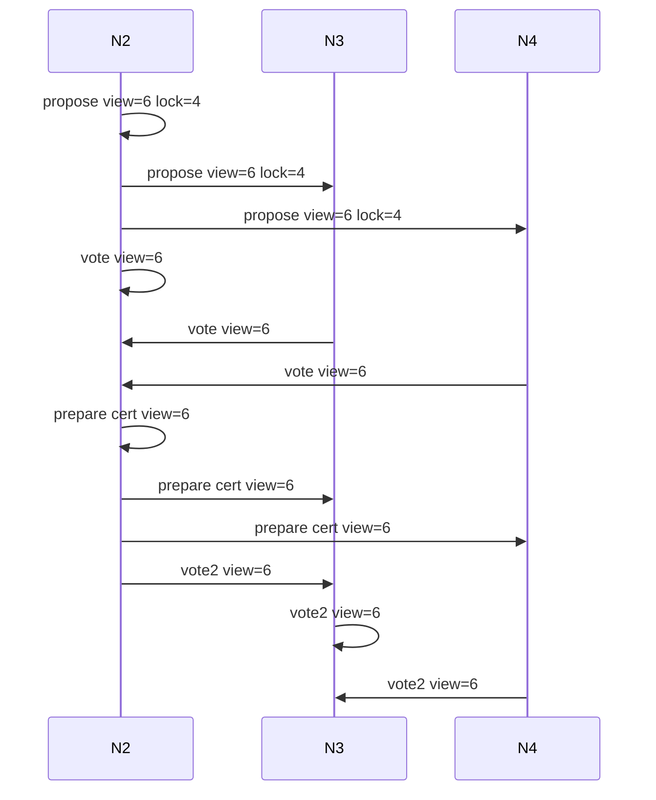
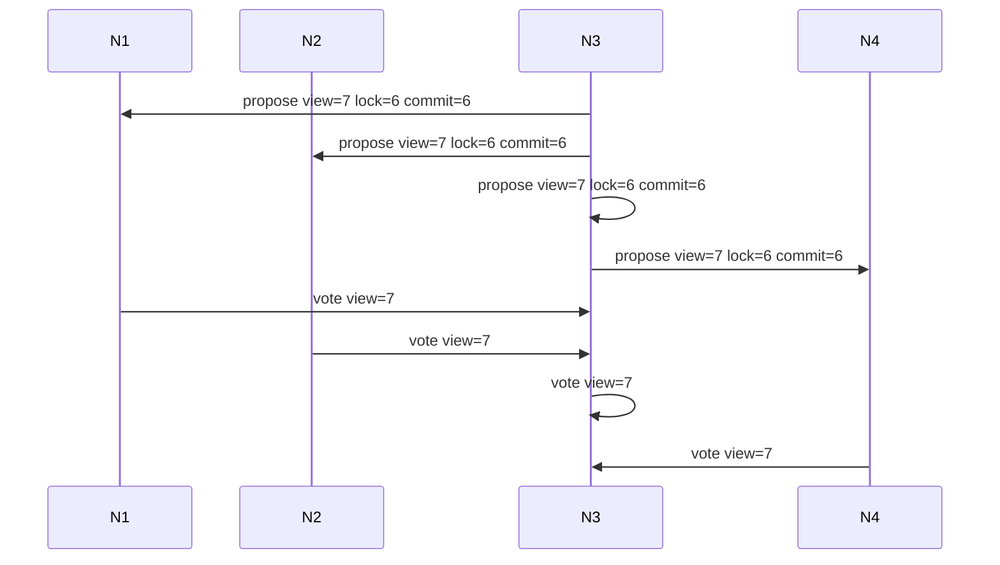
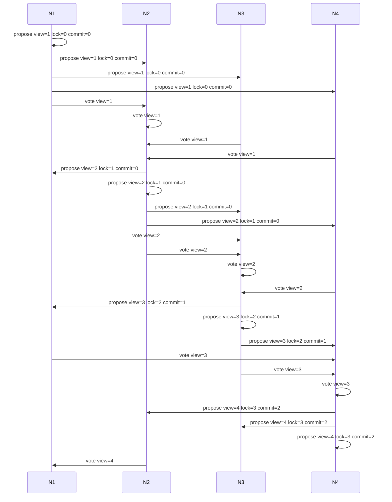

## Sequential vs pipelined execution

### Sequential

#### View synchronization

1. In order to enter view=5 every node sends `wish` with a target view to the next f+1 leaders. In the example below those are N1 and N2.
2. N1 and N2 aggregate wishes into timeout certificates. Those certificates are sent to every other node in the network. They are equivalent and redundant, by aggregating on f+1 nodes we guaranntee that f adversarial nodes can't halt the protocol.   
3. When timeout certificate for a view is received, participants enter view that view.

This subprotocol is executed only on epoch boundary. Epoch boundary is defined to be a view in every f+1 views (view modulo f+1 is one). The assumption here is that there is atleast one honest participant in next f+1 participants, that participant will aggregate wishes and compose timeout certificate. 

#### Progress after timeout in epoch boundary.

After receiving timeout with view 5 all nodes are synchronized to a view 5. I assume round robin leader election, hence N1 is a leader in view 5. 

Nodes entered view 5 without a block certificate from the previous view. Protocol relies on synchrony assumption to receive latest certificate.

I demonstrate the importance of the right assumption about maximal network delay below.  

1. N1 (a leader in view 5) sets a timer for 2 maximal network delays. 1 to send aggregated timeout, 1 to receive locked certificate from any honest node.
2. Highest locked certificate is for the block in view 4, it is not available on N1, hence it needs to be downloaded by peers.
3. As locks from participants are not delivered before second delay triggers N1 will use previously highest known lock, which is lock=3. Every other participant will reject such proposal. 

The succesful sequence of events:

#### Timeout on non epoch boundary.

1. Following the previous example lets assume N1 is faulty. It will be removed from the diagram for simplificate, and the aggregation is performed only by N2. I also assume that round robin leader selection is used, and leader for view 5 was supposed to be N1, and for view 6 it will be N2.
2. Every node sends out highest known lock to N1. It won't be delivered and eventually every node timeouts.
3. We are not on epoch boundary and time is assumed to be synchronized after receiving timeout for view=5, therefore after 7 maximal network delays (TODO elaborate why 7) every node enters view 6.
4. N2 creates proposal with highest known lock (lock for view 4) that will be succeful. 

#### Consecutive progress

1. First example picks up where the previous left. Proposal with highest lock are sent to every other participant.
2. As the proposal extend highest lock every participant will vote positively on it, and send message to the leader of view 6, which is N2.
3. N2 aggregates it into the prepare message and sends out to other participants.
4. Evvery participants update local lock and "confirms" that it received it (note the vote2 dfference). It is sent for aggregation to the leader of next view, in this case this would be view 7 and the round robin leader is N3.

1. Lets split the following events from previous example to make it digestable. Here we also get N1 back.
2. N3 aggregates received vote2 and sends next propose extending. When received every node update commit, and in case of N1 it overwrites previous old lock.
3. Every node sends vote for view 7 which are aggregated by N3, and then the loop repeats.

### Pipelined

#### Happy path

#### Why propose message carries a commit certificate?

On the example above i illustrated condition where N3 failed to deliver proposal to N2. Message from N4 would be rejected by N2 if commit certificate wasn't attached.

The other way to think about it is that I would expect that single round of communication between N3 to N2 is shorter then 2 minimal (optimistic delays). This seems to be a bit more strict then assumptions in sequential version.

## Useful links

- [hotstuff2](https://eprint.iacr.org/2023/397.pdf)
  2-round hostuff with novel view synchronization protocol.
- [original hotstuff](https://arxiv.org/pdf/1803.05069.pdf)
  original 3-round hotstuff and pipelined protocol specification.
- [cogsworth](https://cryptoeconomicsystems.pubpub.org/pub/naor-cogsworth-synchronization/release/5)
  view synchronization protocol referenced in hotstuff2.
- [bls12-381 signature library](https://github.com/supranational/blst)
- [bls12-381 overview](https://hackmd.io/@benjaminion/bls12-381)